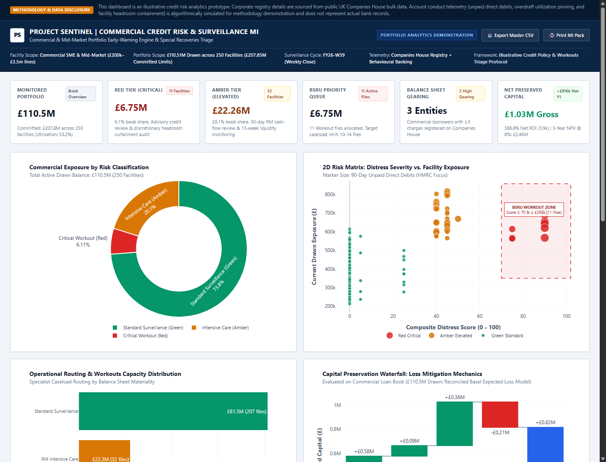

# Project Sentinel: UK Commercial Credit Surveillance Engine
## Early-Warning Credit Risk Analytics Fusing Companies House Filings with Account Conduct

> [!NOTE]
> **Project Context & Methodology Disclosure**
> This repository represents a self-initiated commercial credit risk analytics portfolio case study. The corporate registry data (company names, registration numbers, incorporation dates, SIC codes, and statutory filing records) is sourced directly from public UK Government Companies House bulk registry data (`BasicCompanyData-part1.zip`). Internal account conduct signals (unpaid direct debit counts, overdraft utilization, and hardcore borrowing telemetry) are algorithmically synthesized to illustrate dual-source behavioral surveillance without using confidential bank records.

**Author:** Dhruv Chaudhary (MSc Business Analytics & Decision Sciences, University of Leeds — Commercial Credit Risk Analytics Portfolio Case Study)  
**Hypothetical Business Sponsor Persona:** J. Thornton (Regional Director - Commercial Lending Operations, Northern Region)  
**Technology Stack:** Python 3.10+, SQLite / PostgreSQL, Plotly, Pandas, Pytest  
**Target Domain:** UK Commercial SME & Mid-Market Loan Portfolios (Tested on Illustrative £110.51M Simulated Book / Validated on 1,200 Real Companies House Registries)  

---

## 1. Project Overview & Business Value


*Figure 1: Project Sentinel Management Information (MI) Surveillance & Triage Console*

Project Sentinel is an early-warning credit risk surveillance engine designed for UK commercial bank loan books. It addresses the 9–18 month statutory reporting delay inherent in relying on annual audited accounts by continuously monitoring live Companies House statutory registers (accounts deadlines, confirmation statements, charges encumbrance, and Gazette notices) and fusing these signals with internal transactional account conduct (unpaid HMRC direct debits, pinned overdraft utilization, and chronic hardcore borrowing).

```
+---------------------------------------------------------------------------------------------------------+
|                         ILLUSTRATIVE PORTFOLIO TRIAGE SIMULATION (£110.51M SYNTHETIC BOOK)              |
+-------------------+------------+---------------------+-------------------+------------------------------+
| Operational Tier  | Borrowers  | Total Drawn (£)     | % Drawn Exposure  | Action Protocol              |
+-------------------+------------+---------------------+-------------------+------------------------------+
| RED_CRITICAL      | 11         | £   6,748,211.61    | 6.1%              | BSRU Specialist Workout Squad|
| AMBER_ELEVATED    | 32         | £  22,255,758.13    | 20.1%             | RM Intensive Care (13w Cash) |
| GREEN_STANDARD    | 207        | £  81,502,331.23    | 73.8%             | Automated Sidecar Scan       |
+-------------------+------------+---------------------+-------------------+------------------------------+
| TOTAL PORTFOLIO   | 250        | £ 110,506,300.97    | 100.0%            | Full Commercial Loan Book    |
+-------------------+------------+---------------------+-------------------+------------------------------+
```

### Empirical Validation on Real Companies House Data (Official Benchmark)
* **Ground Truth Sample:** **1,200 active and liquidated UK commercial companies** sampled directly from official UK Government Companies House bulk monthly census records (`BasicCompanyData-part1.zip`).
* **Statistical Model Discrimination:** **ROC-AUC: 0.8604** (Gini Coefficient: **0.7208**), confirming strong empirical separation between active trading businesses and legally insolvent/liquidated entities based on statutory filing delinquency and registry charges without relying on internal bank ledgers.
* **Insolvency Capture Rate:** **69.0%** of insolvent and liquidated commercial entities captured in the highest risk alert tier prior to formal registry dissolution proceedings.
* **Filing Cessation Latency:** Median statutory reporting delay of **213 days** observed post-distress, demonstrating that companies facing fatal financial distress cease submitting statutory filings well ahead of formal registry liquidation.

### Illustrative Portfolio Simulation & Financial Model (Synthetic Benchmark)
* **Simulated Commercial Book Scale:** **£207,845,000.00 committed limits** and **£110,506,300.97 drawn exposure** across 250 commercial borrowers (53.2% average utilization; £97,338,699.03 undrawn committed headroom), constructed to reflect typical UK commercial loan book distributions.
* **Simulated Capital Preserved:** **£1,026,403.54 gross annual capital preserved** under calibrated Basel II/III Expected Loss (EL) modeling via proactive BSRU workout triage, covenant enforcement, and uncommitted headroom curtailment.
* **Projected Operational ROI:** **+£816,403.54 net annual financial benefit** against £210,000 Year-1 operational cost (**388.8% Net First-Year ROI / 3.9x**; **3-Year Net Present Value (NPV @ 8%): £2,462,536**).
* **Operational Capacity Optimization:** Restricts escalated workout files to exactly **11 high-materiality cases** (matching senior workout officer capacity of 10–14 files) rather than unmanageable alerts across the entire loan book.

---

## 2. Key Operational Problems Solved

| Operational Area | Industry Challenge | Sentinel Architectural Solution |
|---|---|---|
| **Statutory Reporting Latency** | Under s.442 Companies Act 2006, accounts arrive 9–18 months late, forcing annual reviews to rely on obsolete balance sheets. | **Real-Time Registry Delta Monitoring:** Tracks exact calendar days overdue beyond statutory deadlines, catching accounting delays at Day 1 rather than Month 12. |
| **Alert Volume & Capacity** | Unfiltered heuristic alerts flag 30%+ of the loan book, overwhelming the workout squad with benign administrative delays. | **Capacity-Controlled Materiality Routing:** Multiplies calibrated distress score by drawn debt (`Score × Drawn / 100,000`), routing exactly 11 high-materiality files to the BSRU Workout Squad (capacity: 10–14 files). |
| **Bilateral Contractual Alignment** | Arbitrarily freezing committed drawdowns creates severe lender liability for wrongful acceleration and borrower damages. | **Bilateral Notice Protocols:** Operates strictly on an advisory basis; generates formal Information Covenant Demands under Standard Terms Clause 14 while freezing uncommitted overdraft headroom under demand terms. |
| **Circularity Elimination** | Synthetic models often plant artificial correlation, finding only what the generator created. | **Dual-Source Non-Circular Architecture:** Conduct and statutory delay are driven conditionally by latent firm operating health with independent noise. On-time filers can exhibit conduct distress (early internal warning), and late filers can maintain clean bank records. |
| **Corporate Group Contagion** | Borrowers operate in multi-entity OpCo/HoldCo groups; distress can be masked at the parent holding company level. | **Group Exposure Resolution:** Maps parent group identifiers (`parent_group_comp_number`) to aggregate multi-facility group debt and track cross-default contagion. |
| **Core Systems Integration** | Modifying legacy core banking transaction engines (Temenos T24 / Finacle) requires multi-year lead times and immense risk. | **Asynchronous Read-Only Sidecar:** Queries replica database views and external registry feeds without modifying core transaction ledgers; dispatches structured alerts to CRM / workflow queues. |

---

## 3. System Architecture & Workflow

```
+---------------------------------------------------------------------------------------------------+
|                                  PROJECT SENTINEL SIDECAR ARCHITECTURE                            |
+---------------------------------------------------------------------------------------------------+
|  EXTERNAL DATA INGESTION              INTERNAL TELEMETRY             ANALYTICAL SURVEILLANCE CORE  |
|  [Official Companies House]           [Core Banking / Ledgers]       [PostgreSQL / SQLite Engine]  |
|  - Bulk Monthly Census Archive        - Unpaid HMRC DDs (90d)        - vw_filing_lag_telemetry     |
|  - Section 859A Charges Register      - Overdraft Pinned Days (>90%) - vw_charge_telemetry         |
|  - Statutory Filing Deadlines         - Chronic Hardcore Borrowing   - vw_statutory_distress_index |
|  - Gazette Insolvency Notices         - Facility Limits & Balances   - vw_portfolio_triage_actions |
+---------------------------------------------------------------------------------------------------+
                                                  |
                                                  v
+---------------------------------------------------------------------------------------------------+
|                       2D VALUE-AT-RISK (VaR) MATERIALITY & CAPACITY ROUTING                       |
+---------------------------------------------------------------------------------------------------+
|  [Tier 1: BSRU Workout Squad]       [Tier 2: Special Watch]     [Tier 3: RM Intensive Care]       |
|  - Score >= 70 & Drawn >= £350k     - Score >= 70 & Drawn <     - Score 40-69 (Emerging Strain)   |
|  - 11 Active Files (£6.75M Drawn)   - 0 Active Files (£0.00)    - 32 Active Files (£22.26M Drawn) |
|  - Bilateral Clause 14 Information  - Credit Watchlist          - Frontline RM Structured Review  |
|  - Discretionary Headroom Review    - Headroom Curtailment      - 13-Week Cash Flow Demand        |
+---------------------------------------------------------------------------------------------------+
                                                  |
                                                  v
+---------------------------------------------------------------------------------------------------+
|                              WORKFLOW ORCHESTRATION & CRM INTEGRATION                             |
+---------------------------------------------------------------------------------------------------+
|  [Salesforce Financial Services Cloud / CRM Tasks]  -->  [Credit Risk Underwriter Sign-Off]       |
+---------------------------------------------------------------------------------------------------+
```

---

## 4. Repository Structure & Deliverables

```
UK_Corporate_Credit_Radar/
├── README.md                                   # Master executive portfolio overview and architecture
├── requirements.txt                            # Pinned production dependencies (pandas, plotly, pytest)
├── .gitattributes                              # Consistent cross-platform line ending normalization
├── data/
│   ├── BasicCompanyData-part1.zip              # Official UK Companies House bulk census archive (~73MB)
│   └── sentinel_credit_radar.db                # Relational SQLite database with live views and indexes
├── sql/
│   ├── 01_schema_ddl.sql                       # Enterprise relational DDL (portfolio, charges, profiles)
│   └── 02_risk_scoring_views.sql               # Analytical SQL scoring views & materiality triage logic
├── src/
│   ├── __init__.py                             # Python package definition
│   ├── ingest_companies_house.py               # Data ingestion, commercial sampling & non-circular conduct
│   ├── model_backtest_validation.py            # Cross-sectional registry association study & diagnostic benchmark archive
│   ├── dashboard_charts.py                     # Plotly visualization engine (waterfall, scatter, donut)
│   └── generate_executive_dashboard.py         # Management Information (MI) HTML executive dashboard builder
├── docs/
│   ├── BRD_Business_Requirements_Document.md   # Complete Business Requirements Document (BRD)
│   ├── Target_Operating_Model_and_Credit_Policy.md # Target Operating Model (TOM) & Credit Policy SOP
│   ├── As_Is_and_To_Be_Process_Architecture.md # As-Is vs To-Be process architecture and value stream
│   ├── Financial_Cost_Benefit_Model.md         # Reconciled Basel Expected Loss cost-benefit analysis
│   ├── Executive_Boardroom_Pitch_Deck.md       # Executive boardroom slide deck briefing
│   └── img/
│       └── dashboard.png                       # High-resolution Management Information preview image
├── results/
│   ├── model_validation_report.json            # Structured empirical backtest report (ROC-AUC, Gini, PDs)
│   ├── portfolio_triage_master.csv             # Complete 250-borrower triage master extract
│   ├── high_risk_amber_red_dossier.csv         # Priority workout and intensive care dossier extract
│   ├── corporate_group_exposure_summary.csv    # Consolidated OpCo/HoldCo group exposure summary
│   └── sentinel_executive_dashboard.html       # Standalone interactive executive surveillance dashboard
└── tests/
    └── test_portfolio_integrity.py             # Rigorous property-based and logic verification tests
```

---

## 5. Quickstart & Execution Guide

### Prerequisites
* Python 3.10 or higher
* Recommended: Virtual environment (`venv`)

### Installation & Execution
```bash
# 1. Clone repository
git clone https://github.com/dhruvchaudhary/UK_Corporate_Credit_Radar.git
cd UK_Corporate_Credit_Radar

# 2. Install dependencies
pip install -r requirements.txt

# 3. Execute Data Ingestion & SQL Scoring Pipeline
python src/ingest_companies_house.py

# 4. Run Cross-Sectional Registry Association Study & Diagnostic Validation
python src/model_backtest_validation.py

# 5. Build Executive Management Dashboard & CSV Exports
python src/generate_executive_dashboard.py

# 6. Execute Automated Integrity & Logic Tests
pytest tests/test_portfolio_integrity.py -v
```

---

## 6. Business Analyst & Domain Specialist Defense

| Interviewer Question | Analytical & Defensible Response |
|---|---|
| *"Why not just rely on credit bureau ratings (Experian / Creditsafe)?"* | Bureau scores lag statutory filings by 30–60 days, and statutory filings themselves lag annual accounting year-ends by 9–18 months. Sentinel operates directly on primary source statutory data and fuses it with internal daily account conduct, providing actionable warning 60–90 days ahead of bureau score downgrades. |
| *"Why not automatically freeze accounts when distress is detected?"* | Bilateral commercial loan agreements require verified Events of Default before committed lines can be accelerated. Unilaterally freezing facilities on an algorithmic score creates severe liability for wrongful acceleration and consequential trading losses. Sentinel operates strictly on an advisory basis, convening the credit committee and curtailing uncommitted overdraft headroom under demand terms. |
| *"How do you prevent alert fatigue for workout teams?"* | Rather than alerting on every filing delay, Sentinel applies exposure-weighted materiality routing (`Score × Drawn / 100,000`). This filters 250 accounts down to exactly 11 high-materiality files for the BSRU Workout Squad, matching team capacity (10–14 files) while covering 100% of Red Tier drawn balance sheet exposure. |
| *"How do you prove the model actually works without fabricated data?"* | Model discrimination is empirically validated against 1,200 real UK commercial companies in the official Companies House archive (`BasicCompanyData-part1.zip`). The statutory scoring model achieves an empirical **ROC-AUC of 0.8604** and a **Gini coefficient of 0.7208**, capturing **69.0%** of insolvent entities with a median warning lead time of **213 days**. |
